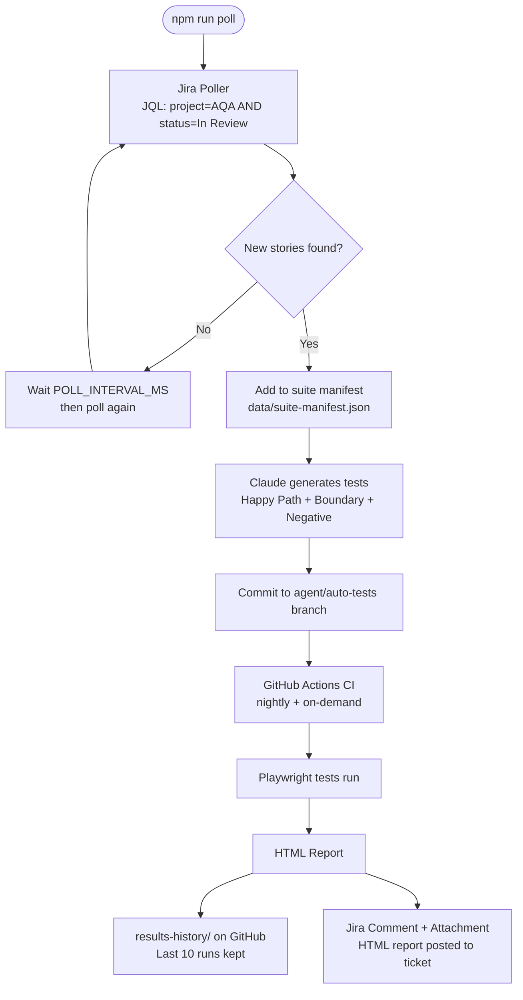

# Agentic AI — Polling Edition

An evolution of the original [agentic-ai-playwright-poc](https://github.com/vikrampb/agentic-ai-playwright-poc) that automatically discovers Jira stories ready for testing, generates comprehensive test suites, and runs them on a schedule.

## How it differs from the original project

| Feature | Original | Polling Edition |
|---|---|---|
| Story discovery | Manual — you enter Jira keys at a prompt | Automatic — polls Jira for "In Review" stories |
| Test generation | Plain-English cases you type interactively | Claude auto-generates happy path + boundary + negative |
| CI trigger | On demand (`npm run agent`) | Nightly schedule + on demand |
| Results storage | Local `local-reports/` only | `results-history/` on GitHub — last 10 runs |
| Jira result | Comment on ticket | Comment + HTML report attached to ticket |
| Interactive prompt | ✅ Enabled | ⬜ Commented out (can re-enable) |
| Login demo UI | ✅ Enabled | ⬜ Commented out (can re-enable) |

---

## Architecture



---

## Quick start

```bash
# 1. Clone and install
git clone https://github.com/YOUR_USERNAME/agentic-ai-polling-poc.git
cd agentic-ai-polling-poc
npm install
npx playwright install --with-deps chromium

# 2. Configure
cp .env.example .env
# Edit .env with your keys

# 3. Seed database
npm run db:init

# 4. Run in polling mode
npm run poll

# OR run once interactively (same as original project)
npm run agent
```

---

## Environment variables

All original variables plus:

| Variable | Default | Description |
|---|---|---|
| `RUN_MODE` | `interactive` | `poll` to enable auto-polling |
| `JIRA_PROJECT_KEY` | `AQA` | Jira project to poll |
| `JIRA_READY_STATUS` | `In Review` | Status that triggers test generation |
| `JIRA_POLL_INTERVAL_MS` | `120000` | Poll interval (2 min demo / 3600000 for 1 hr) |
| `MAX_SUITE_SIZE` | `0` | Max stories in suite (0 = unlimited) |
| `MAX_HISTORY_RUNS` | `10` | Run reports to keep (11th prunes oldest) |

---

## Test generation — three categories

When a story is discovered by the poller, Claude generates:

1. **Happy Path** — expected successful scenarios (US_PERSON login succeeds)
2. **Boundary Conditions** — edge cases (empty credentials, special characters)
3. **Negative Tests** — failure scenarios (NON_US_PERSON blocked, wrong password)

---

## Results history

After each CI run, an HTML report is committed to `results-history/` on the `agent/auto-tests` branch:

```
results-history/
  index.html                          ← Auto-generated index of all runs
  run-001-2026-06-29T00-00-00-passed.html
  run-002-2026-06-29T08-00-00-failed.html
  ...
```

The 11th run automatically deletes the oldest. View the index at:
```
https://github.com/YOUR_USERNAME/agentic-ai-polling-poc/blob/agent/auto-tests/results-history/index.html
```

---

## CI schedule

The GitHub Actions workflow runs:
- **Nightly** at midnight UTC (`cron: '0 0 * * *'`)
- **On demand** via `workflow_dispatch` in the GitHub Actions UI
- **On push** to any `agent/**` branch

---

## Re-enabling commented features

**Interactive prompt** — in `src/agent/index.ts`, uncomment the `INTERACTIVE_PROMPT_START/END` blocks

**Login demo UI** — in `src/agent/index.ts`, uncomment the `LOGIN_UI_START/END` blocks

---

## Project structure

```
agentic-ai-polling-poc/
├── .env.example
├── .github/workflows/ci.yml      # Nightly + on-demand schedule
├── src/agent/
│   ├── index.ts                  # Orchestrator — interactive + polling modes
│   ├── jiraPoller.ts             # NEW — JQL polling + suite manifest
│   ├── resultsHistory.ts         # NEW — 10-run history on agent branch
│   ├── testGenerator.ts          # Updated — happy/boundary/negative auto-gen
│   ├── report.ts                 # HTML dashboard
│   ├── loginUi.ts                # (commented out in polling mode)
│   └── prompt.ts                 # (commented out in polling mode)
├── src/jira/client.ts            # Updated — adds attachFile()
├── src/db/seed.ts                # 10 users
└── src/github/client.ts          # Octokit wrapper
```
